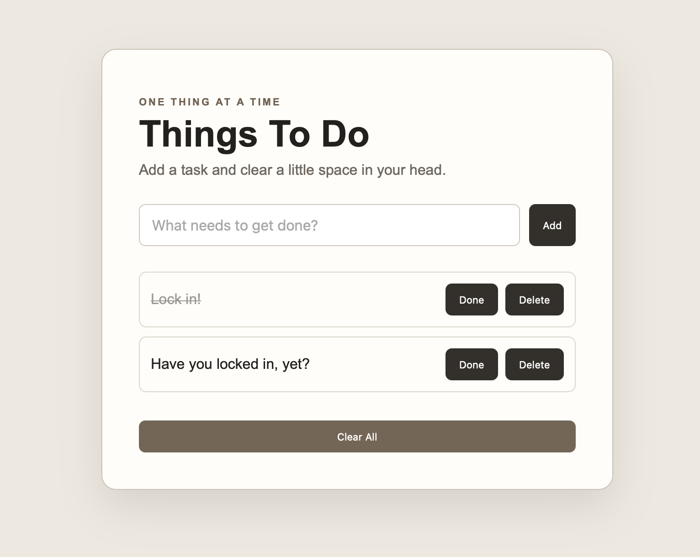

# Things To Do: Productivity Tracker

A browser-based task manager built with HTML, CSS, and JavaScript. Users can add tasks, mark them complete, delete individual items, and clear the full task list.

**Live Site:** [View the project](https://to-do-productivity-tracker.netlify.app)

## How It's Made

**Tech used:** HTML5, CSS3, JavaScript

The application uses JavaScript to manage task creation and update the interface in response to user actions. Event listeners connect the input and task controls to the application logic, while DOM manipulation is used to add tasks, mark items complete, remove individual tasks, and clear the full list.

HTML provides the application structure, CSS handles the visual presentation and responsive layout, and JavaScript controls the interactive behavior and task state shown in the interface.

## Optimizations

Future iterations could add persistent storage so tasks remain available after a page refresh, strengthen accessibility and keyboard interactions, improve validation for empty or duplicate entries, and expand task organization features such as priorities, deadlines, or filtering.

## Lessons Learned

Building this project strengthened my understanding of event-driven JavaScript and DOM manipulation. I practiced creating and removing elements dynamically, responding to user input, updating interface state, and connecting multiple controls to a shared task workflow.
